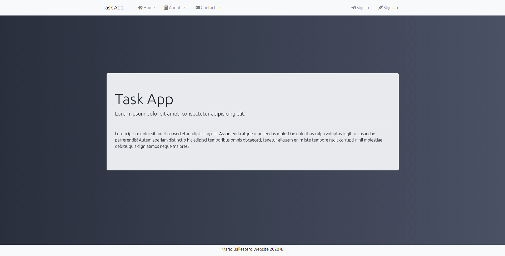
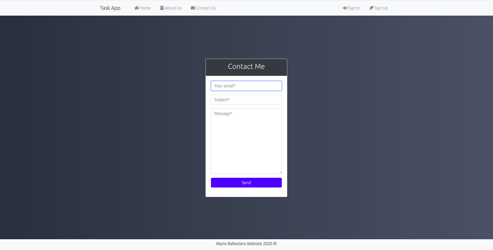
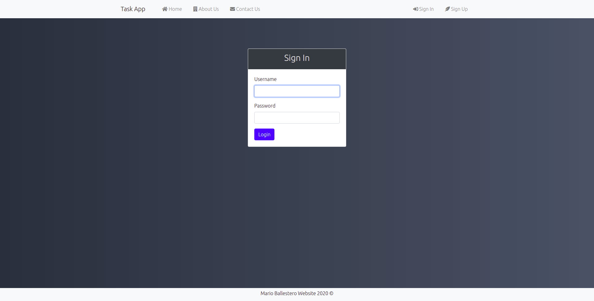
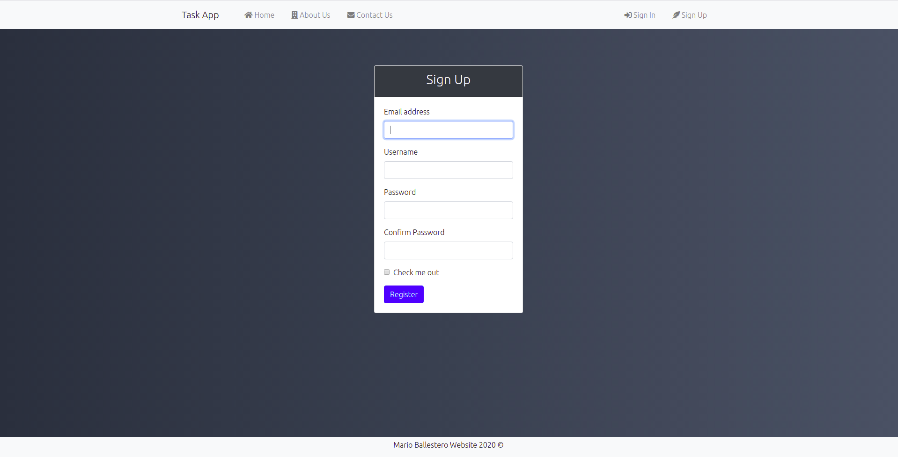
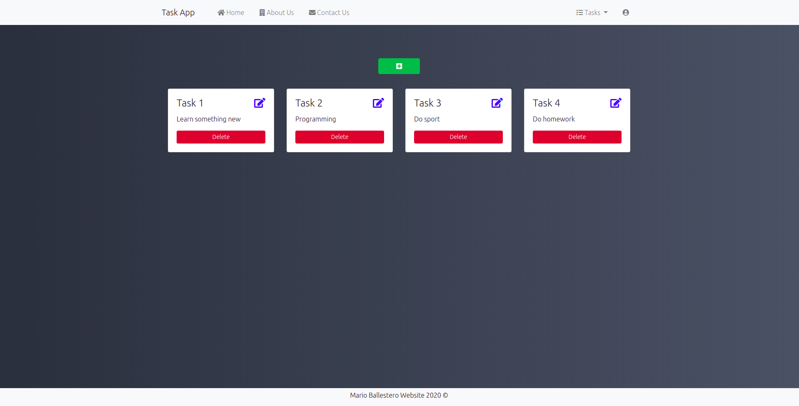
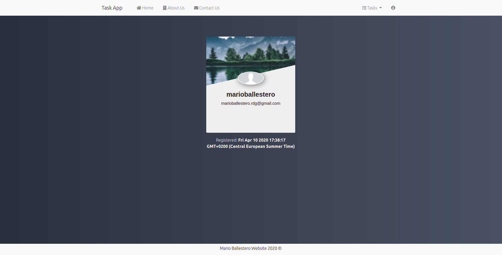

# Task App

A tasks App with Authentication using Nodejs, Express and Mongodb.


### Installing

---

Clone the Repository and run

```
npm install
npm run dev
```


### Build With

---

- [Node JS](https://nodejs.org/es/)

- [Express](https://expressjs.com/es/)
- [Mongoose](https://mongoosejs.com/)
- [Handlebars](https://handlebarsjs.com/)
- [Passport](http://www.passportjs.org/)
- [Nodemailer](https://nodemailer.com/)


### Contributing

---

Please feel free to send pull request if you want to contribute!


### Authors

---

- Mario Ballestero - [mariobalrod](https://github.com/mariobalrod)


### Templates:

---




















